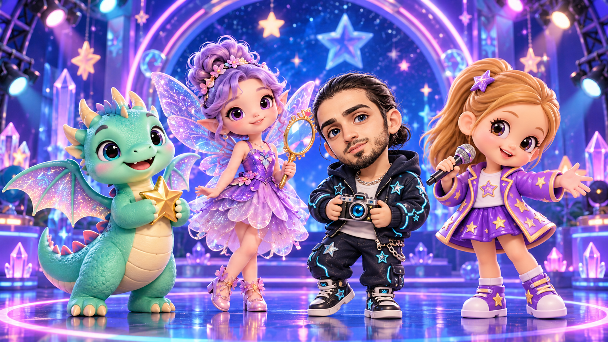
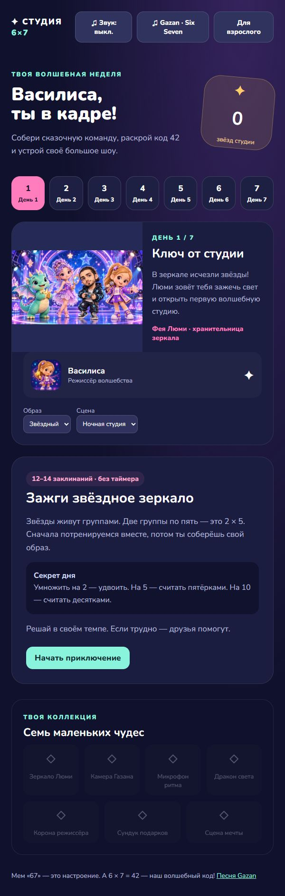
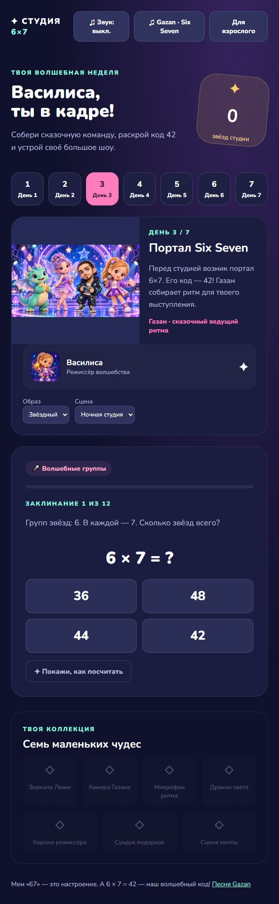
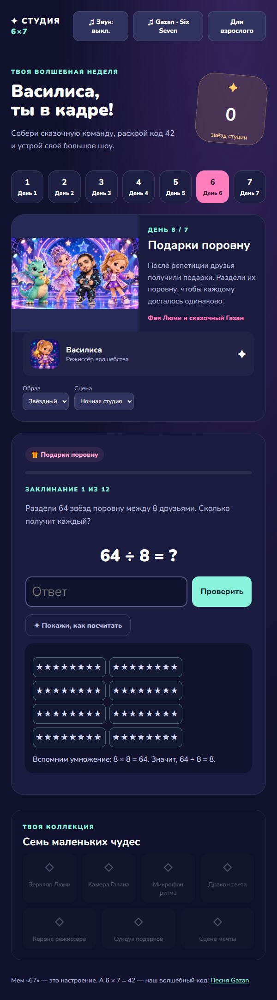

# Василиса в кадре — Студия 6×7

**Браузерная игра для изучения таблицы умножения и деления в 3–4 классе.** Семь сказочных приключений превращают тренировку примеров в подготовку собственного волшебного шоу.

**[Играть онлайн](https://vasilisa-studio-6x7.vercel.app/)** · [Сценарий недели](Сценарий-недели.md) · [Публикация](DEPLOY.md)

**[Установить на устройство](https://vasilisa-studio-6x7.vercel.app/install.html)** · [Инструкция установки](INSTALL.md) · [Установочные файлы Windows и Android](https://github.com/dmmshiryaev-bit/vasilisa-studio-6x7/releases/tag/v0.2.0)



## Задача и пользователь

Помочь ребёнку заниматься математикой с интересом: вместо однообразного списка примеров — собственный персонаж, сказочная команда, коллекция предметов и премьера студии. Визуальная тема подобрана под интересы Василисы: образы, зеркало, видео и музыкальный мем Six Seven.

Игра создана для ученицы 3–4 класса и взрослого, который сопровождает обучение. Это персональный игровой прототип: результат обучения ещё не измерялся, а прохождение недели не гарантирует запоминание всей таблицы.

## Возможности

- Семь глав с короткими сюжетами и наградами: от открытия студии до большого шоу.
- Умножение на числа от 2 до 10, деление без остатка и смешанная практика.
- Четыре варианта ответа в первых главах и самостоятельный ввод начиная с пятой.
- Наглядные подсказки с равными группами звёзд, сложением и разложением произведений.
- Возвращение ошибочного примера через несколько заданий и учёт прежних ошибок.
- Семь коллекционных предметов, выбор аксессуара и цвета сцены, анимированный клип.
- Игрушечный аватар Василисы и сказочный образ Gazan на общей иллюстрации.
- Сохранение прогресса, отчёт для взрослого и выгрузка результатов в JSON.
- Собственный игровой ритм, официальный музыкальный плеер и выбор локального аудио.

Обязательного таймера и штрафов за ошибки нет. Занятие включает 12 основных заданий, до двух примеров из прошлых ошибок и дополнительные повторы — всего не более 18.

## Программа недели

| День | Приключение | Математика |
| --- | --- | --- |
| 1 | Ключ от студии | Умножение на 2, 5, 10 |
| 2 | Камера облаков | Умножение на 3 и 4 |
| 3 | Портал Six Seven | Умножение на 6 и 7; код 6×7=42 |
| 4 | Дракон и созвездия | Умножение на 8 и 9 |
| 5 | Репетиция волшебства | Смешанные примеры, самостоятельный ввод |
| 6 | Подарки поровну | Деление через связь с умножением |
| 7 | Большое шоу 42 | Умножение и деление, финальная сцена |

Дни доступны для свободного выбора и повторения. Реплики, завязки, награды и ветвления — в [полном сценарии](Сценарий-недели.md).

## Скриншоты работающей игры

Снимки сделаны с опубликованной версии. Откройте изображение, чтобы рассмотреть детали.

| Студия и карта недели | Умножение 6×7 | Деление с подсказкой |
| --- | --- | --- |
|  |  |  |

## Стек

HTML5, CSS3, JavaScript без фреймворков и библиотек. `localStorage` хранит прогресс на устройстве, Web Audio API создаёт ритм, File API позволяет выбрать локальный аватар и музыку. Хостинг — Vercel. Иллюстрации созданы и отредактированы с помощью imagegen; проект разработан с помощью Codex.

Серверная часть, аккаунты и база данных для игры не требуются.

## Как запустить

Самый быстрый способ — [открыть опубликованную игру](https://vasilisa-studio-6x7.vercel.app/).

Локальный запуск:

```sh
git clone https://github.com/dmmshiryaev-bit/vasilisa-studio-6x7.git
cd vasilisa-studio-6x7
python -m http.server 4173 --bind 127.0.0.1
```

Откройте **http://127.0.0.1:4173/**. На некоторых системах Python запускается командой `python3`.

Можно также открыть `index.html` напрямую. Чтобы прогресс сохранялся предсказуемо, используйте один браузер и один адрес запуска.

## Проверка

Нужен Node.js 20 или новее. Сторонние пакеты не нужны:

```sh
npm test
```

Проверяются математический банк, четыре уникальных варианта ответа, прохождение семи дней, подсказка и возврат ошибки, сохранение и отсутствие повторного начисления наград. Это проверка игровой логики с имитацией DOM, а не автоматический тест браузерного оформления.

Вручную проверены загрузка иллюстраций, начало заданий, ввод ответа, исправление ошибки, завершение дня деления и узкий экран. В GitHub Actions та же проверка логики запускается при изменении кода.

## Структура проекта

```text
index.html                интерфейс игры
style.css                 оформление и адаптация под экран
game.js                   сценарии, математический банк и прогресс
img/                      используемые игровые иллюстрации
  screenshots/            три скриншота для README
smoke-test.cjs             проверка игровой логики
package.json              команда npm test, без зависимостей
vercel.json                настройки статической публикации
Сценарий-недели.md         полный сценарий семи занятий
DEPLOY.md                 инструкция публикации
ASSETS.md                 происхождение графики и музыки
.github/workflows/        автоматическая проверка
```

## Данные и музыка

Прогресс хранится только в браузере и не синхронизируется между устройствами. Очистка данных браузера удаляет результаты. Незавершённое занятие после перезагрузки начинается заново, но учтённые ответы сохраняются.

Раздел «Для взрослого» позволяет скачать отчёт, выбрать готовый аватар и аудиофайл. Он не защищён паролем. Выбранные файлы игра не отправляет на сервер; аудио сохраняется локально в IndexedDB и доступно после перезапуска. Если браузер запретил хранение или закончилось место, игра сообщает, что файл нужно выбрать заново.

Песня **Gazan — «67 (Six Seven)»** открывается в официальном Spotify-плеере. Доступность зависит от Spotify и интернета. По умолчанию используется собственный ритм. Исходная фонограмма не хранится в репозитории.

Внешние подключения: Google Fonts для шрифта и Spotify при открытии плеера. Без них доступны системный шрифт и основная игровая механика. Камера и публикация личных видео не используются.

## Состояние проекта

Рабочий прототип опубликован на Vercel. Добавлены устанавливаемая веб-версия с офлайн-кешем, Windows-приложение на Electron и Android-приложение на Capacitor. Главы используют общий математический экран с разными сюжетами. Клип — анимация, а не запись видеофайла. В банк не включены отдельные задания на 0 и 1.

Следующие шаги: самостоятельные мини-игры с перетаскиванием предметов, озвучка персонажей и более подробное повторение отдельных математических фактов. Эти возможности пока не реализованы.

Происхождение изображений и музыкальной темы описано в [ASSETS.md](ASSETS.md).
